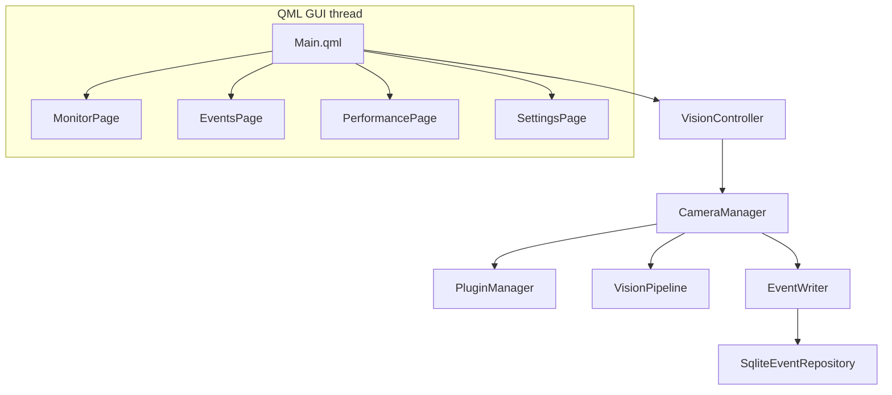
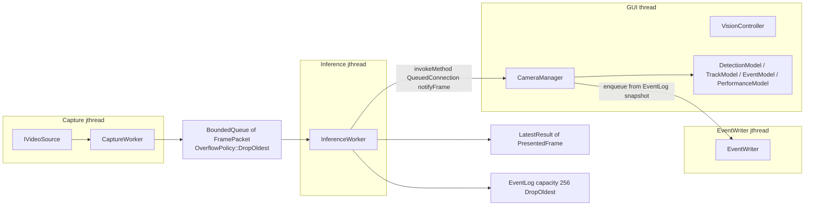
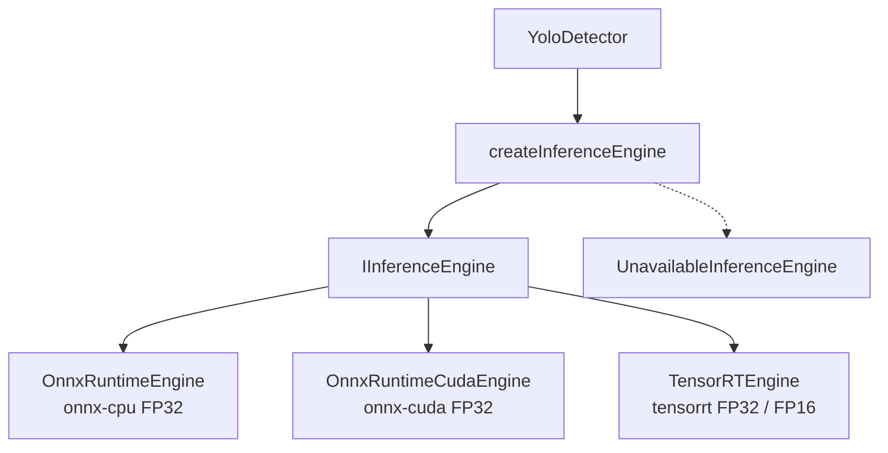
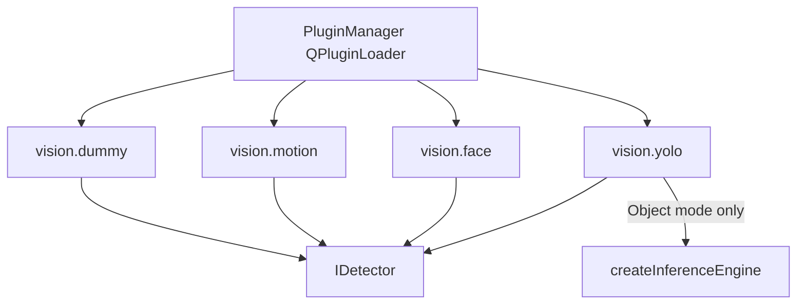
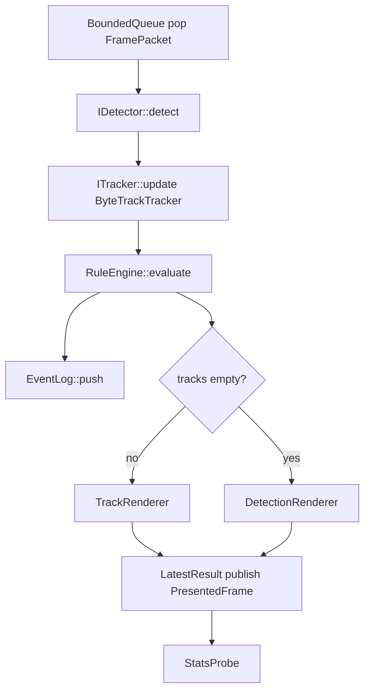

# Architecture (VisionLab Pro)

Five diagrams of the **current** pipeline. If a diagram disagrees with source,
**source wins**. There is no dedicated `RuleWorker` thread. Production
`CameraManager::assembleFromPlugins` injects an empty `RuleEngine`; the UI
pushes `RuleSpec` lists only while the pipeline is **stopped**.

## 1. Overall

QML talks only to `VisionController`. `CameraManager` owns discovery, the
pipeline, and persistence.

`VisionController` and the `*Model` types stay on the GUI thread
(`docs/ui/qml-boundary.md`). Core / pipeline / detectors do not include QML.

## 2. Threads

Capture, inference, and SQLite run on `std::jthread`. Frames use a bounded
queue. The GUI is notified with `Qt::QueuedConnection`.

Shutdown in `CameraManager::~CameraManager`: `VisionPipeline::stop()` then
`EventWriter::stop()`. `VisionPipeline::joinWorkers` requests stop, closes the
source and queue, then joins capture then inference. `CameraManager::stop()`
stops the pipeline only; the writer stays up for history queries.

## 3. Inference

Object mode (`YoloDetector`) is the only detector that uses
`IInferenceEngine`. Face uses OpenCV DNN Caffe. Motion uses MOG2. Dummy is a
plugin test double.

Selection is `ModelConfig.backend` / env `VISIONLAB_INFERENCE_BACKEND`. GPU
initialize failure does **not** fall back to CPU. TensorRT is compiled only
when `VISIONLAB_ENABLE_TENSORRT=ON`. INT8 is not implemented.

## 4. Plugins vs inference backends

These are **different** extension points. Backends are not `IVisionPlugin`
instances. Plugins are not unloaded in V1.

Scan directory: `VISIONLAB_PLUGIN_DIR` or `<app>/plugins`. `CameraManager`
declares `PluginManager m_plugins` before `m_pipeline` so detectors die before
`QPluginLoader`. See `docs/plugins/detector-plugins.md`.

## 5. Detect → track → rules → render → EventLog

All of this runs **inside** `InferenceWorker::run` on the inference `jthread`.
Rules are not a separate worker.

Default production engine has **no** ROI / line / loiter / count rules until
`CameraManager::applyRuleSpecs` (stopped pipeline) or `injectRules` copies the
stored `RuleSpec` list. `PresentedFrame.events` is this frame only.
`LatestResult` is newest-wins; sparse events also go to `EventLog`.
`EventWriter` persists EventLog increments from `notifyFrame` on the GUI
thread via a second bounded queue (capacity 1024, DropOldest).
